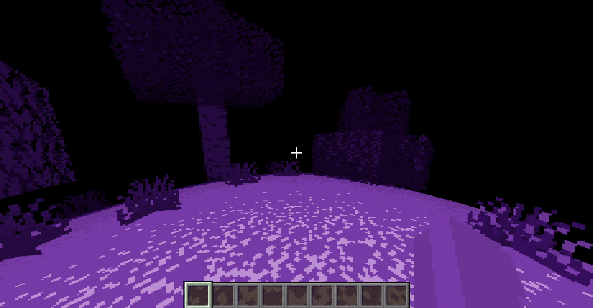

# dark-world-shader
A minecraft shader that stylizes the world by making it monochrome, limiting vision, and curving the world around the player. This shader pixelates and dynamically adjusts the world around the player to artistically express the day/night cycle in the horror style unique to the shader.

Below is an example image of minecraft gameplay with this shader applied.

